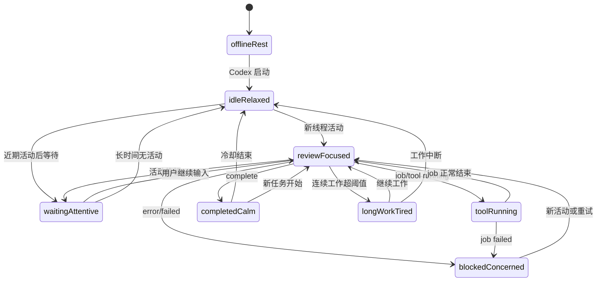

# 动作体系设计与实现

## 背景

当前桌宠动作已经从静态切换升级为离线补间帧，但实际观感暴露出更根本的问题：

- 动作切换时有模糊感。
- `turning` 完整转身动作很奇怪，不适合作为常规陪伴动作。
- 当前动作库只覆盖 `running`、`waving`、`turning` 等少数动作，缺少表情、微动作、状态反馈和交互反馈。

这说明后续不能只继续“补关键帧”。需要先定义完整动作体系：角色在不同状态下应该有哪些表情、姿态、微动作、小动作、中动作、大动作和交互动作；每类动作如何触发、如何互斥、如何回到基础姿态；哪些动作适合整帧补间，哪些必须生成真实关键帧或拆分图层。

## 核心判断

### 1. 桌宠动作的目标是“陪伴感”，不是“展示资产”

完整转身本质上是 turntable 展示素材，适合检查角色多角度一致性，不适合默认出现在 ambient 或 hover 场景。桌面 companion 的动作应该像一个低干扰的工作陪伴者：看向用户、眨眼、扶眼镜、整理姿态、短暂走神、注意力回到工作，而不是突然完整旋转身体。

### 2. 表情比大动作更重要

当前动作主要依赖身体姿态变化，但角色是否“活着”首先来自脸部和眼神。眨眼、视线移动、微笑、专注、疑惑、疲惫、错误反馈，比大幅转身更自然，也更不打扰用户。

### 3. 大轮廓动作不能靠整帧 crossfade 解决

premultiplied-alpha 整帧补间适合轮廓变化小的动作，例如眨眼、轻微挥手、点头。转身、走动、伸展、坐姿切换等大轮廓动作，如果直接混合整帧，会出现重影和模糊。大动作要么生成真实中间关键帧，要么改成分层部件动画。

## 设计目标

1. **自然**：动作像角色在陪伴用户，而不是模型在展示。
2. **克制**：默认动作低干扰，大动作稀有且有明确语义。
3. **丰富**：不仅有身体动作，也有表情、视线、呼吸、姿态和状态反馈。
4. **可读**：用户能从动作和表情大致感知 Codex 当前状态。
5. **清晰**：减少整帧大幅混合导致的模糊、重影和比例跳变。
6. **可维护**：动作命名、资产目录、调度策略和测试都能表达动作语义。

## 当前落地状态

本轮已完成 clip-based 动作调度体系：`PetActionCatalog` 负责动作层级、优先级、可用状态、表情语义和冷却描述；`PetActionTimeline` 负责冲突决策；runtime 拆分为微动作、小动作、大动作和交互调度器；默认主动作都有 PNG 帧目录、帧数策略、时长策略和状态逻辑回归。

脸部表情不再按独立 overlay 推进。当前决策是 [动作立绘自带表情方案](../decisions/2026-05-19-baked-action-expression.md)：每个动作 clip 自带适合该动作语义的表情，`PetExpression` 作为动作资产的语义标签保留，不表示 runtime 独立图层。

## 角色行为模型

动作体系分为五个层次。`PetPresentationState` 是当前角色可以长期停留的展示状态，不再把其它姿态都当作插播动作。

```text
Codex 元数据
  -> CodexWorkPhase
  -> PetPresentationState
  -> 状态切换动作 Transition
  -> 状态内动作 Ambient
  -> 表情语义 Expression
  -> 微动作层 Micro Motion
  -> 交互反馈层 Interaction
```

| 层 | 职责 | 是否常驻 | 是否可叠加 | 示例 |
|----|------|----------|------------|------|
| Presentation State | 当前可长期停留的展示状态 | 是 | 否 | `reviewFocused`、`toolRunning`、`waitingAttentive` |
| Transition | 展示状态切换时的进入/离开动作 | 否 | 否 | `wake-up`、`adjust-glasses`、`cursor-look` |
| Expression | 动作自带的脸部、眼神、情绪语义 | 否 | 不叠加 | `focused`、`curious`、`happy`、`tired` |
| Micro Motion | 很轻的生命感 | 是 | 可叠加 | 呼吸、重心微移、头发轻摆 |
| Ambient Action | 当前展示状态内的短动作 | 否 | 一般互斥 | 挥手、扶眼镜、查看笔记、伸展 |
| Interaction | 用户触发的反馈 | 否 | 高优先级 | hover 看向光标、拖动暂停、右键关注 |

这套模型的关键是：展示状态常驻，动作短暂插入，表情由当前姿态或动作 clip 自带。动作结束后必须自然回到当前 `PetPresentationState`，而不是统一回到 `review`、`waiting` 或 `failed`。对于 `toolRunning`、`completedCalm`、`longWorkTired` 这类动作感更强的展示状态，runtime 会停在动作 clip 中段的可读帧，避免所有终态看起来都像旧版第 0 帧静图。

展示状态不能随每一次元数据轻微变化立刻跳转。runtime 使用 `PetPresentationTransitionPolicy` 做状态防抖：当前状态有最小停留时间，候选状态需要持续命中后才生效；只有离线和错误状态保持即时切换。这样可以避免 `reviewFocused`、`toolRunning`、`waitingAttentive` 在短时间里互相抢位。

## Codex 联动状态机

当前只读取 Codex 本地元数据，不读取 session 正文、用户消息、模型回复或代码内容。元数据先进入 `CodexWorkPhase`，再映射为桌宠可停留展示状态：

| CodexWorkPhase | PetPresentationState | 触发依据 | 语义 |
|----------------|----------------------|----------|------|
| `offline` | `offlineRest` | Codex 进程不存在 | Codex 暂不可用。 |
| `idle` | `idleRelaxed` | 无近期线程活动、无活跃 job/goal | 待命，不打扰。 |
| `thinking` | `reviewFocused` | 近期线程有更新，且无 running job | 正在思考或整理上下文。 |
| `runningTool` | `toolRunning` | `agent_jobs` / `agent_job_items` 有 running/pending，或 `logs_2.sqlite` 最近 8 秒出现工具相关 `target` | 正在执行工具或任务。 |
| `waitingUser` | `waitingAttentive` | 近期线程有活动但短时间未更新 | 等待用户确认或下一步输入。 |
| `blocked` | `blockedConcerned` | 最近 error 日志或 failed job | 遇到错误，需要关注。 |
| `completed` | `completedCalm` | 最近 job/goal 完成 | 当前轮次完成，短暂确认。 |
| `longWorking` | `longWorkTired` | 连续活跃超过阈值 | 工作时间较长，需要舒展提醒。 |



| 展示状态 | 停留姿态 | 进入动作 | 状态内动作 |
|----------|----------|----------|------------|
| `offlineRest` | `failed` | 无 | 无或极低频静止。 |
| `idleRelaxed` | `waiting` | `shoulder-relax` | `breathing`、`weight-shift`、`shoulder-relax`、`hair-sway`。 |
| `waitingAttentive` | `waiting` | `cursor-look` | `cursor-look`、`waving`、`hover-smile`。 |
| `reviewFocused` | `review` | `adjust-glasses` | `adjust-glasses`、`thinking`、`nod`、`check-notes`。 |
| `toolRunning` | `tap-keyboard` 中段帧 | `tap-keyboard` | `tap-keyboard`、`focus-shift`、`check-notes`。 |
| `blockedConcerned` | `failed` 中后段帧 | `tired-soften` | `glance-left/right`、`shoulder-relax`。 |
| `completedCalm` | `nod` 中后段帧 | `nod`、`hover-smile` | `hover-smile`、`nod`、`shoulder-relax`。 |
| `longWorkTired` | `stretch-wrist` 中段帧 | `stretch-wrist` | `stretch-wrist`、`shoulder-relax`、`fix-posture`。 |

## 表情体系

### 表情状态

| 表情 | 语义 | 适用状态 | 视觉要点 |
|------|------|----------|----------|
| `neutral` | 默认平静 | waiting、idle | 放松眼神，嘴角自然。 |
| `focused` | 专注工作 | working | 眼神偏向屏幕/下方，眉眼收紧。 |
| `thinking` | 思考中 | working、waiting | 视线轻微上移或侧移，嘴部收敛。 |
| `curious` | 被用户吸引注意 | hover、waiting | 眼睛略睁大，头部轻偏。 |
| `happy` | 正向反馈 | 用户唤起、轻交互 | 轻微微笑，眼神更亮。 |
| `tired` | 长时间等待或低活跃 | waiting 长时间 | 眼皮降低，姿态更松。 |
| `surprised` | 突发状态变化 | Codex 从离线到在线、快速活动 | 短暂睁眼或轻抬眉。 |
| `error` | 离线或失败感 | offline | 低落、困惑或无力，不夸张。 |

### 表情动作

| 动作 | 类型 | 频率 | 时长 | 说明 |
|------|------|------|------|------|
| `blink`、`slow-blink` | 旧表情 clip | 暂不默认调度 | `0.12-0.8s` | 资产保留，后续优先烘焙进基础姿态或动作 clip。 |
| `eye-shift-left/right` | 旧表情 clip | 暂不默认调度 | `0.4-0.9s` | 不再作为独立调度层；视线变化随 `cursor-look`、`glance` 等动作画入。 |
| `small-smile`、`focus-tighten`、`relax-face` | 旧表情过渡 | 暂不默认调度 | `0.6-1.2s` | 语义保留，视觉效果改为动作立绘自带表情。 |

### 技术建议

短期继续使用整帧 PNG 序列，但表情不拆独立图层。每个动作 clip 选择一种最合适的表情并直接画入帧中：

- 眼睛：open、half、closed、look-left、look-right。
- 眉眼：neutral、focused、curious、tired。
- 嘴部：neutral、small-smile、thinking、error。
- 头部：正面、微左、微右、低头、抬头。

只有当动作数量和表情组合明显膨胀时，才重新评估局部分层；当前阶段先避免 runtime 合成复杂度。

## 姿态体系

| 姿态 | 语义 | 使用场景 | 说明 |
|------|------|----------|------|
| `review` | 专注审阅 | working 基础姿态 | 当前工作态基础姿态。 |
| `waiting` | 等待输入 | waiting 基础姿态 | 当前等待态基础姿态。 |
| `failed` | 离线/不可用 | offline 基础姿态 | 低干扰，不频繁动。 |
| `idle-relaxed` | 放松站立 | 长时间 waiting | 可作为 waiting 的变体。 |
| `idle-alert` | 准备响应 | hover 前后、状态切换 | 更精神但不夸张。 |
| `focus-left/right` | 轻微注意力偏移 | 中动作峰值 | 替代完整转身。 |

基础姿态不应该只有一张图。每个状态至少需要 2-3 个基础姿态变体，调度器可以低频切换，避免长时间静止显得僵硬。

## 动作分层

| 层级 | 作用 | 触发频率 | 典型动作 | 建议时长 | 技术策略 |
|------|------|----------|----------|----------|----------|
| 表情动作 | 让角色有情绪 | 高频 | 眨眼、视线移动、微笑 | `0.1-1.2s` | 最好局部图层；短期可整帧。 |
| 微动作 | 让角色不僵硬 | 高频但弱感知 | 呼吸、头发轻摆、重心微移 | `0.8-1.8s` | 小幅局部变化，可循环。 |
| 小动作 | 提供陪伴感 | `6-12s` | 挥手、点头、扶眼镜、轻敲手指 | `1.2-2.4s` | 关键帧 + 少量补间。 |
| 中动作 | 表达注意力转移 | `25-60s` | 看向左/右、整理衣服、伸肩 | `2.0-3.0s` | 真实中间关键帧，避免整帧大轮廓混合。 |
| 大动作 | 罕见的存在感变化 | `90s+` | 伸懒腰、走半步、姿态切换 | `3.0-5.0s` | 专门关键帧或分层动画。 |
| 交互反馈 | 响应用户操作 | 用户触发 | hover 看向光标、拖动暂停、右键关注 | `0.3-2.0s` | 高优先级，可打断普通动作。 |

## 动作库设计

### 动作内表情语义

| 动作 | 推荐表情 | 触发 | 说明 |
|------|----------|------|------|
| `review` | `focused` | working 基础姿态 | 眼神专注，不夸张。 |
| `adjust-glasses` | `focused` | working | 符合审阅/处理语义。 |
| `thinking`、`check-notes` | `thinking` | working | 视线和嘴部更收敛。 |
| `waving` | `happy` 或 `curious` | waiting、轻交互 | 正反馈动作，表情可以更明确。 |
| `cursor-look` | `curious` | hover | 看向用户，不完整转身。 |
| `weight-shift`、`shoulder-relax`、`stretch` | `neutral` 或 `tired` | 长等待或舒展 | 不做强情绪。 |
| `failed` | `error` | offline | 低干扰地表达不可用。 |

### 微动作

| 动作 | 层级 | 触发 | 说明 |
|------|------|------|------|
| `breathing` | 微动作 | 常驻循环 | 1-2 像素级胸肩起伏，不能明显缩放整个人。 |
| `hair-sway` | 微动作 | 随机或跟随动作 | 头发轻微延迟，增强柔和感。 |
| `weight-shift` | 微动作 | waiting | 重心轻微左右变化。 |
| `shoulder-relax` | 微动作 | working 结束 | 肩部放松。 |
| `tiny-hand-adjust` | 微动作 | working | 手部小幅调整，不进入显眼动作。 |

### 小动作

| 动作 | 层级 | 触发 | 说明 |
|------|------|------|------|
| `waving` | 小动作 | waiting、轻交互 | 保留，但不应过频。 |
| `nod` | 小动作 | working、状态切换 | 轻点头，表达确认。 |
| `adjust-glasses` | 小动作 | working | 符合 OL 角色设定，适合替代无意义 running。 |
| `tap-keyboard` | 小动作 | working | 暗示正在协助处理，不需要真的出现键盘。 |
| `check-notes` | 小动作 | working | 低头看一眼，再回到 review。 |
| `stretch-wrist` | 小动作 | 长时间 working | 手腕轻微活动。 |

### 中动作

| 动作 | 层级 | 触发 | 说明 |
|------|------|------|------|
| `glance-left` | 中动作 | waiting/working 低频 | 头部和肩膀轻偏，不完整转身。 |
| `glance-right` | 中动作 | waiting/working 低频 | 与 `glance-left` 轮换。 |
| `focus-shift` | 中动作 | working | 从看屏幕到看用户，再回到工作。 |
| `fix-posture` | 中动作 | 长时间静止 | 轻微站直或整理姿态。 |
| `adjust-outfit` | 中动作 | waiting 低频 | 整理衣服或袖口，动作要克制。 |
| `look-around` | 中/大动作 | waiting 很低频 | 正面 -> 左 3/4 -> 正面 -> 右 3/4 -> 正面，不展示背面。 |

### 大动作

| 动作 | 层级 | 触发 | 说明 |
|------|------|------|------|
| `stretch` | 大动作 | 长时间 waiting 或 working | 明显但低频的伸展。 |
| `step-aside` | 大动作 | 极低频 | 轻微横移半步，再回原位；需要真实关键帧。 |
| `sit-to-stand` | 大动作 | 未来形态切换 | 需要新姿态体系，不纳入第一轮。 |
| `turntable` | 调试动作 | 手动触发 | 完整转身，只用于素材检查，不进入默认动作池。 |

### 交互反馈

| 动作 | 触发 | 优先级 | 说明 |
|------|------|--------|------|
| `cursor-look` | 鼠标悬停 | 高 | 视线/头部看向光标，不完整转身。 |
| `hover-smile` | 鼠标悬停持续 | 中 | 旧交互 clip，默认 hover 先用 `cursor-look`。 |
| `drag-freeze` | 拖动开始 | 最高 | 暂停动画，避免拖动时动作漂移。 |
| `drag-release-settle` | 拖动结束 | 高 | 回到基础姿态，必要时做轻微整理。 |
| `context-menu-attend` | 右键菜单 | 高 | 角色短暂停止并看向用户。 |
| `wake-up` | Codex 启动/恢复 | 高 | 从 offline/error 过渡到 waiting。 |
| `work-start` | 进入 working | 高 | 表情转 focused，姿态进入 review。 |
| `work-done` | 退出 working | 中 | 放松表情，回到 waiting。 |

## 状态动作池

| 状态 | 表情 | 基础姿态 | 微动作 | 小动作 | 中动作 | 大动作 |
|------|------|----------|--------|--------|--------|--------|
| `working` | 动作自带 `focused`、`thinking` | `review` | `breathing`、`tiny-hand-adjust`、`hair-sway` | `adjust-glasses`、`nod`、`tap-keyboard`、`check-notes` | `focus-shift`、`glance-left/right`、`fix-posture` | `stretch` 极低频 |
| `waiting` | 动作自带 `neutral`、`curious`、长等待 `tired` | `waiting`、`idle-relaxed` | `weight-shift`、`shoulder-relax`、`tiny-hand-adjust` | `waving` | `glance-left/right`、`adjust-outfit`、`look-around` | `stretch`、`step-aside` 极低频 |
| `offline` | `error`、`tired` | `failed` | 很少或无 | 无 | `wake-up` 只在恢复时 | 无 |
| hover | 动作自带 `curious`、`happy` | 当前姿态 | 暂停普通随机微动作 | `waving` / `nod` | `cursor-look` / `focus-shift` | 不触发完整转身 |
| drag | 保持当前表情 | 当前帧冻结 | 无 | 无 | `drag-release-settle` | 无 |

## 动作组合语法

动作体系的核心不是“随机播放单个动作”，而是把表情、微动作、姿态和主动作组合成可理解的短句。组合必须表达一个明确想法：专注、等待、被打扰后回应、恢复工作、长时间空闲、离线恢复等。

### 组合结构

```text
entry cue -> micro motion -> main action with expression -> settle -> base loop
```

| 位置 | 作用 | 可省略 | 示例 |
|------|------|--------|------|
| `entry cue` | 进入组合的引子，让动作不突兀 | 可省略 | `breathing`、`tiny-hand-adjust` |
| `micro motion` | 让动作有呼吸和生命感 | 可省略 | `breathing`、`hair-sway` |
| `main action with expression` | 组合的核心动作，动作帧自带表情 | 不可省略 | `adjust-glasses(focused)`、`cursor-look(curious)`、`waving(happy)` |
| `settle` | 回到当前状态，不停在峰值 | 不可省略 | `shoulder-relax`、`fix-posture` |
| `base loop` | 回到基础姿态和常驻微动作 | 不可省略 | `review + focused`、`waiting + neutral` |

组合的时长应短而明确：普通组合 `1.2-3.0s`，低频大组合 `3.0-5.0s`。如果一个组合超过 5 秒，通常应该拆成两个组合。

### 叠加规则

| 组合层 | 可叠加 | 不应叠加 |
|--------|--------|----------|
| 表情 + 基础姿态 | 随姿态资产 | 表情不能和当前状态矛盾，例如 offline 时不持续 `happy`。 |
| 眨眼 + 呼吸 | 暂不独立组合 | 后续烘焙进基础姿态或轻动作。 |
| 视线 + 头部轻偏 | 随动作资产 | 不要同时做反方向视线和头部，例如头向左但眼向右。 |
| 小动作 + 表情变化 | 随动作资产 | 不要同时播放两个小动作，例如挥手同时扶眼镜。 |
| 中动作 + 微动作 | 部分可以 | 中动作不叠加大幅呼吸或重心变化，避免轮廓漂移。 |
| 大动作 + 其他动作 | 基本不可以 | 大动作期间只保留必要表情，不叠加其他主动作。 |

## 场景组合库

### 工作态组合

| 组合名 | 动作短句 | 使用场景 | 表达想法 | 频率建议 |
|--------|----------|----------|----------|----------|
| `work-enter` | `waiting -> adjust-glasses(focused) -> review(focused)` | Codex 从等待进入工作 | “收到任务，开始专注处理。” | 状态切换时触发 |
| `focused-review` | `review(focused) -> breathing -> review(focused)` | 工作态常驻 | “正在看内容/审阅。” | 常驻循环 |
| `adjust-and-continue` | `review -> adjust-glasses(focused) -> nod(focused) -> review` | 工作中小动作 | “认真检查，继续推进。” | `12-30s` |
| `thinking-pause` | `review -> thinking(thinking) -> tiny-hand-adjust -> review(focused)` | 工作中短暂停顿 | “在思考下一步。” | `20-45s` |
| `work-done` | `review(focused) -> shoulder-relax(neutral) -> waiting(neutral)` | 工作结束/活动变少 | “这轮处理结束，回到等待。” | 状态切换时触发 |

`working` 组合要避免过度活泼。工作态的动作应该更小、更利落，强调专注和可靠，不应频繁挥手或大幅移动。

### 等待态组合

| 组合名 | 动作短句 | 使用场景 | 表达想法 | 频率建议 |
|--------|----------|----------|----------|----------|
| `calm-wait` | `waiting(neutral) -> breathing -> waiting(neutral)` | 等待态常驻 | “安静待命。” | 常驻循环 |
| `soft-greeting` | `waiting -> waving(happy/curious) -> waiting(neutral)` | 用户回来或轻交互 | “我在这里，有事可以叫我。” | hover 后或低频 |
| `look-around-light` | `waiting -> glance-left(curious) -> waiting(neutral)` | 普通等待中动作 | “短暂看向旁边，又回到待命。” | `25-60s` |
| `long-wait-tired` | `waiting(tired) -> weight-shift(tired) -> idle-relaxed` | 长时间无交互 | “等久了，有点放松/困。” | `90s+` |
| `ready-again` | `idle-relaxed(tired) -> cursor-look(curious) -> waiting(neutral)` | 长等待后用户回来 | “重新注意到用户。” | hover 或活动恢复 |

`waiting` 可以比 `working` 更有生活感，但仍要低干扰。挥手不应作为默认高频动作，否则会像提示动画而不是陪伴。

### 交互组合

| 组合名 | 动作短句 | 使用场景 | 表达想法 | 优先级 |
|--------|----------|----------|----------|--------|
| `hover-attend` | working: `cursor-look/focus-shift/nod`；waiting: `cursor-look/waving` | 鼠标悬停 | “注意到用户了。” | P1 |
| `hover-release` | `cursor-look -> current base pose` | 鼠标离开 | “回到原来的状态。” | P1 |
| `context-menu-attend` | `current pose -> context-menu-attend(curious)` | 右键菜单打开 | “正在等待用户选择。” | P1 |
| `drag-start` | `current frame -> drag-freeze` | 拖动开始 | “被用户拿起，动作暂停。” | P0 |
| `drag-end` | `drag-freeze -> drag-release-settle -> current base pose` | 拖动结束 | “站稳并回到状态。” | P0 |

交互组合要直接、短、可打断。用户悬停时不应播放完整转身；正确反馈是看向用户、轻微表情变化和短暂停留。

### 离线与恢复组合

| 组合名 | 动作短句 | 使用场景 | 表达想法 | 频率建议 |
|--------|----------|----------|----------|----------|
| `offline-rest` | `failed(error)` | Codex 离线 | “暂时不可用，低干扰。” | 极低 |
| `wake-up` | `failed + error -> surprised -> neutral -> waiting` | Codex 恢复运行 | “恢复在线，重新待命。” | 状态切换时触发 |
| `activity-spike` | `waiting -> adjust-glasses(focused) -> review` | 突然进入工作 | “检测到活动，开始处理。” | 状态切换时触发 |

离线态不做丰富 ambient。离线时动作越多，越容易让用户误解为系统还在活跃工作。

### 低频存在感组合

| 组合名 | 动作短句 | 使用场景 | 表达想法 | 限制 |
|--------|----------|----------|----------|------|
| `posture-reset` | `base pose -> fix-posture(neutral/focused) -> base pose` | 长时间没有主动作 | “调整一下站姿。” | `60s+` 冷却 |
| `look-around` | `waiting -> glance-left -> neutral -> glance-right -> waiting` | 长等待 | “轻微环顾环境。” | 不展示背面 |
| `stretch-light` | `idle-relaxed -> stretch-wrist/shoulder(tired) -> idle-relaxed` | 很长等待或工作后 | “轻微舒展。” | `120s+` 冷却 |

低频存在感组合要稀有。它们用于打破长时间静止，不应该抢用户注意力。

## 组合禁用规则

| 禁用组合 | 原因 | 替代 |
|----------|------|------|
| hover -> 完整 `turntable` | 语义不明，像模型展示。 | `hover-attend` / `cursor-look` |
| working -> 高频 `waving` | 工作态挥手会破坏专注感。 | `adjust-glasses` / `nod` |
| offline -> 丰富小动作 | 离线却很活跃会误导状态。 | `offline-rest` |
| 大动作期间叠加眨眼/挥手 | 容易穿帮和轮廓混乱。 | 大动作只保留必要表情 |
| `glance-left` 后立刻 `glance-right` 高频轮换 | 像机械扫描。 | 加冷却或使用 `look-around` 低频组合 |
| `tired` 表情 + `happy` 表情快速互切 | 情绪不连贯。 | 先 `ready-again` 再轻微 `small-smile` |

## 组合选择策略

调度器选择动作时，应先选“场景组合”，再展开到具体动作，而不是直接从动作列表里随机抽一个动作。

```text
当前状态 + 触发来源 + 最近动作历史
  -> 选择组合类型
  -> 选择表情
  -> 选择主动作
  -> 注入微动作
  -> 播放并记录冷却
```

示例：

| 输入条件 | 组合选择 | 输出动作 |
|----------|----------|----------|
| `working`，刚进入状态 | `work-enter` | `focus-tighten -> review + focused` |
| `working`，空闲 20 秒 | `adjust-and-continue` | `eye-shift-down -> adjust-glasses -> nod` |
| `waiting`，用户 hover | `hover-attend` | `cursor-look` 或 `waving` |
| `waiting`，长时间无活动 | `long-wait-tired` | `slow-blink -> tired-soften -> weight-shift` |
| `offline -> waiting` | `wake-up` | `surprised -> neutral -> waiting` |

这种做法可以让同一个动作在不同组合里表达不同语义。例如 `blink` 在 `focused-review` 里是自然生命感，在 `long-wait-tired` 里是疲惫，在 `hover-release` 里是结束交互后的回落。

## 转身动作重新定义

默认动作体系不再使用完整 `turning`。完整转身保留为 `turntable` 或 `model-review`，只用于资产检查、调试或未来展示模式。

| 新动作 | 替代原场景 | 动作描述 |
|--------|------------|----------|
| `glance-left/right` | 常规大动作 | 头部和肩膀向侧边偏 `15-25°`，随后回到基础姿态。 |
| `cursor-look` | hover | 视线和头部看向光标方向，停顿后回到原姿态。 |
| `look-around` | 低频大动作 | 正面 -> 左 3/4 -> 正面 -> 右 3/4 -> 正面，不展示背面。 |
| `turntable` | 调试/素材评审 | 完整多角度转身，可包含背面，不进入默认动作池。 |

## 动作语法

每个非基础动作都应遵循同一个动作语法：

```text
rest pose -> anticipation -> action peak -> settle -> rest pose
```

- `rest pose`：当前状态基础姿态，例如 `review` 或 `waiting`。
- `anticipation`：动作前的轻微预备，例如视线先动、肩膀微收。
- `action peak`：动作最明显的关键帧，例如扶眼镜接触点、看向侧边峰值。
- `settle`：回落帧，速度比进入时慢一点。
- `rest pose`：回到当前状态基础姿态，不悬停在无意义中间姿势。

动作不能只做 `A -> B -> A` 线性混合。缺少 anticipation 和 settle 时，即使帧数增加，也会显得机械。

## 调度规则

动作系统需要多个调度器协同，而不是一个 timer 随机挑动作。当前拆成微动作调度器、小动作调度器、大动作调度器、交互调度器。它们共享同一个 timeline 和动作锁，避免时间冲突。表情由被调度动作的 clip 自带，不再单独占用一个调度器。

### 调度器分工

| 调度器 | 管理内容 | 触发方式 | 默认节奏 | 能否打断其他动作 |
|--------|----------|----------|----------|------------------|
| `MicroMotionScheduler` | 呼吸、头发、重心微移 | 常驻 loop + 随机 | `0.8-8s` | 不打断主动作，主动作峰值时暂停。 |
| `SmallActionScheduler` | 挥手、点头、扶眼镜、轻敲 | 状态随机 | `6-12s` | 不打断交互和大动作，可等待主动作空窗。 |
| `LargeActionScheduler` | 伸展、look-around、姿态切换 | 长冷却随机 | `60-180s` | 不主动打断，只在空闲窗口执行。 |
| `InteractionScheduler` | hover、drag、右键、状态切换 | 用户/系统事件 | 事件驱动 | 可打断 ambient；drag 可打断全部。 |

四类调度器不能各自直接播放动画。它们只能向统一的 `ActionTimeline` 提交动作请求，由 timeline 决定立即播放、延后、合并或丢弃。

### 统一时间线

```text
Scheduler Request
  -> ActionTimeline
  -> conflict check
  -> reserve time window
  -> play action / queue action / drop action
  -> record cooldown and history
```

`ActionTimeline` 至少需要维护：

| 状态 | 作用 |
|------|------|
| `currentAction` | 当前正在播放的主动作或交互动作。 |
| `currentExpression` | 当前表情状态。 |
| `currentPose` | 当前基础姿态。 |
| `reservedUntil` | 已被主动作占用到哪个时间点。 |
| `suppressedLayers` | 当前被暂停的层，例如主动作峰值期间暂停眨眼。 |
| `cooldowns` | 每个动作和组合的下次可播放时间。 |
| `recentHistory` | 最近播放过的组合，用于避免重复和机械感。 |

所有动作请求都应声明预计时长、动作层、可否打断、可否排队、可否丢弃。没有这些元数据，就很难正确处理时间冲突。

### 优先级

| 优先级 | 类型 | 行为 |
|--------|------|------|
| P0 | drag、退出、启动错误 | 立即打断所有动作。 |
| P1 | hover、context menu、状态切换 | 可打断 ambient，但不打断 P0。 |
| P2 | working/waiting 状态动作 | 当前动作播完后执行。 |
| P3 | 微动作、眨眼 | 可与基础姿态叠加；主动作峰值期间可暂停。 |
| P4 | 低频大动作 | 只有空闲窗口足够长时执行。 |

### 时间冲突处理

| 当前正在播放 | 新请求 | 处理方式 | 原因 |
|--------------|--------|----------|------|
| `drag-freeze` | 任意非 P0 | 丢弃或延后 | 拖动时视觉稳定优先。 |
| hover 交互 | 小动作 | 延后 | 用户反馈优先于 ambient。 |
| hover 交互 | 大动作 | 丢弃 | hover 通常很短，大动作不应排队抢占。 |
| 状态切换 | 小/大动作 | 丢弃 | 状态表达优先，旧状态动作已过期。 |
| 小动作 | 表情眨眼 | 如果不是峰值可叠加，否则延后 | 避免眼睛在关键帧穿帮。 |
| 小动作 | 小动作 | 延后或丢弃 | 同层互斥。 |
| 小动作 | 大动作 | 丢弃大动作 | 大动作低优先级，不应打断正在发生的陪伴动作。 |
| 大动作 | hover | 打断大动作并 settle | 用户交互优先。 |
| 大动作 | 状态切换 | 打断大动作并切状态 | 状态准确性优先。 |
| 表情过渡 | 另一表情过渡 | 合并到目标表情 | 避免表情快速抖动。 |

### 时间窗口和空窗判断

大动作只能在足够空闲窗口内播放。调度器应先判断：

- 当前没有 P0/P1/P2 动作。
- 最近 `8-12s` 内没有用户 hover、拖动、右键。
- 当前状态稳定至少 `10-15s`，避免状态刚切换就播大动作。
- 预计动作时长小于可用空窗，例如 `largeActionDuration + settleDuration <= idleWindow`。
- 上一个大动作冷却已结束。

如果条件不满足，大动作默认丢弃，而不是排队。排队的大动作很容易在用户回来时突然播放，造成突兀感。

### 冷却和互斥

- 同一个动作短时间内不能重复，默认冷却 `30-90s`。
- 同层动作互斥：主动作播放时不再启动另一个主动作。
- 表情随动作资产一起播放，不叠加独立脸部动作，避免主动作峰值期间穿帮。
- 大动作必须检查用户是否正在拖动、hover、或 Codex 状态是否刚变化。
- 长时间 waiting 才允许 `tired` 表情和 `slow-blink` 增多。

建议使用两级冷却：

| 冷却类型 | 作用 | 示例 |
|----------|------|------|
| 动作冷却 | 避免同一动作重复 | `adjust-glasses` 播放后 `30-60s` 内不再出现。 |
| 组合冷却 | 避免同一语义重复 | `soft-greeting` 播放后 `60-120s` 内不再主动挥手。 |

还需要记录同类动作冷却。例如 `glance-left` 和 `glance-right` 虽然是两个动作，但都属于 `attention-shift` 组合族，短时间内不能来回扫视。

### 各调度器的默认节奏

| 调度器 | 工作态节奏 | 等待态节奏 | 离线态节奏 |
|--------|------------|------------|------------|
| 微动作 | 呼吸常驻，手部小调整 `20-45s` | 呼吸常驻，重心变化 `12-30s` | 基本暂停 |
| 小动作 | `12-30s`，偏专注动作 | `10-25s`，偏招呼和等待动作 | 不播放 |
| 大动作 | `120s+`，且只在长时间稳定工作后 | `90-180s`，长等待才允许 | 不播放 |
| 交互 | 事件驱动 | 事件驱动 | 只允许 `wake-up` 类恢复动作 |

这些节奏是上限约束，不是强制播放。调度器应该允许“这一轮什么都不做”，留白比动作过密更自然。

### 请求生命周期

每个动作请求进入 timeline 后，只能有四种结果：

| 结果 | 含义 | 适用动作 |
|------|------|----------|
| `playNow` | 立即播放 | P0/P1 或空窗中的 P2。 |
| `queue` | 短暂排队 | 小动作，可等待当前小动作 settle。 |
| `merge` | 合并目标状态 | 表情过渡，例如 `curious -> happy`。 |
| `drop` | 丢弃 | 大动作、过期状态动作、冷却未结束动作。 |

队列必须很短，只保留一个候选小动作。大动作不进队列，状态切换动作不进队列，避免旧意图延迟播放。

### 时间冲突示例

| 时间线 | 事件 | 正确行为 |
|--------|------|----------|
| `t=0` small action 开始，`t=0.4` 用户 hover | hover 打断小动作，进入 `hover-attend`，小动作不恢复。 |
| `t=0` large action 准备开始，`t=0.1` 状态变 working | 丢弃 large action，播放 `work-enter`。 |
| `t=0` blink 即将触发，`t=0.05` adjust-glasses 到峰值 | blink 延后到 settle 后。 |
| `t=0` waiting 已 120s，large action 触发，`t=0.5` 用户拖动 | drag 立即冻结，large action 终止并在释放后回基础姿态。 |
| `t=0` hover-release，`t=0.2` small action timer 到点 | small action 延后至少 `2-4s`，避免刚离开就立刻动。 |

### 动作选择

调度器不应只依赖裸数组随机播放。当前已经引入动作描述，用来把动作层级、状态限制、表情搭配、冷却、优先级和排队策略集中表达：

```swift
struct PetActionDescriptor {
    let animation: PetAnimation
    let layer: PetActionLayer
    let priority: PetActionPriority
    let allowedStatuses: Set<CodexActivityStatus>
    let expressions: [PetExpression]
    let cooldown: ClosedRange<TimeInterval>
    let canQueue: Bool
    let defaultEligible: Bool
}
```

这样可以表达动作层级、状态限制、表情搭配、冷却时间和优先级，而不是把所有大动作都映射到 `turning`。

## 资产规范

### 命名

动作目录应该使用语义命名，而不是素材来源命名：

```text
assets/lingxi-ol-hires/
  poses/
    review/
    waiting/
    failed/
    idle-relaxed/
  expressions/
    blink/
    slow-blink/
    focus-tighten/
    small-smile/
    tired-soften/
  actions/
    waving/
    adjust-glasses/
    nod/
    glance-left/
    glance-right/
    look-around/
    stretch/
  debug/
    turntable/
```

短期为了兼容现有加载器，可以先保持扁平目录，但 manifest 里要标注动作层级和语义。

### 帧数建议

| 类型 | 推荐帧数 | 时长 | 说明 |
|------|----------|------|------|
| 眨眼 | `3-5` | `0.12-0.25s` | open -> closed -> open。 |
| 慢眨眼 | `6-10` | `0.4-0.8s` | 等待态更自然。 |
| 表情过渡 | `8-12` | `0.6-1.2s` | neutral/focused/happy/tired 切换。 |
| 微动作 | `12-24` | `0.8-1.8s` | 可循环，但振幅要小。 |
| 小动作 | `16-24` | `1.2-2.4s` | 挥手、扶眼镜等。 |
| 中动作 | `18-32` | `2.0-3.0s` | 需要真实中间关键帧。 |
| 大动作 | `32-60` | `3.0-5.0s` | 需要专门设计，不默认启用。 |

### 补间策略

| 动作类型 | 可用整帧补间 | 推荐方式 |
|----------|--------------|----------|
| 眨眼、嘴部微笑 | 不推荐作为独立补间 | 直接烘焙进对应动作立绘。 |
| 小幅挥手、点头 | 可用 | 整帧补间 + 真实峰值帧。 |
| 头部/肩膀轻偏 | 勉强可用 | 最好生成真实中间帧。 |
| 转身、走动、伸展 | 不推荐 | 真实关键帧或分层骨骼/部件动画。 |

## 插帧算法选型

桌宠素材是透明 PNG 序列，不是普通视频。插帧算法必须优先考虑透明边缘、角色身份一致性、脸和手的稳定性、动作语义是否自然。对这个项目来说，算法的目标不是把所有动作都“变丝滑”，而是在不破坏角色和轮廓的前提下，减少小动作的跳变。

### 评估维度

| 维度 | 重要性 | 判断标准 |
|------|--------|----------|
| 透明通道支持 | 高 | RGBA 边缘不发灰、不漏底色、不产生绿色残留。 |
| 身份一致性 | 高 | 脸、眼镜、发型、衣服轮廓不漂移。 |
| 大轮廓动作表现 | 高 | 转身、伸展、横移不会出现双影。 |
| 可控性 | 高 | 能按我们定义的关键帧和动作语义生成，而不是自由发挥。 |
| 依赖成本 | 中 | 是否需要 GPU、模型下载、复杂环境。 |
| 可回归 | 中 | 同样输入能稳定生成同样输出。 |
| 运行时成本 | 高 | 默认 runtime 不应依赖 ML 模型。 |

### 候选算法矩阵

| 方案 | 适合场景 | 优点 | 风险 | 结论 |
|------|----------|------|------|------|
| Premultiplied-alpha crossfade | 表情、小幅姿态、小幅手部动作 | 简单、确定、无依赖，当前已使用。 | 大轮廓变化会模糊和重影。 | 保留为 baseline，只用于小轮廓动作。 |
| 2D 部件/网格变形 | 眨眼、嘴部、头部轻偏、手臂小幅运动 | 清晰、可控、适合透明角色。 | 需要拆分图层或标注控制点。 | 推荐作为生产主线。 |
| Mask-aware optical flow | 头部轻偏、手部小动作、真实中间帧较少的动作 | 比 crossfade 更能跟随局部运动；可离线跑。 | 平滑色块、透明边缘、遮挡区域容易估错。 | 可做 PoC，不作为唯一方案。 |
| RIFE | 普通视频、较快离线插帧 | 速度快，支持任意时间点插帧。 | 对透明 PNG、脸部小结构和大轮廓动作未必稳定。 | 可作为离线候选，不进 runtime。 |
| FILM | 大运动照片/视频插帧，高质量离线生成 | 面向大运动，官方实现支持高分辨率 patch。 | TensorFlow/GPU 依赖较重；输出仍需人工验收。 | 适合离线预览和对比。 |
| AnimeInterp | 动画视频插帧 | 专门针对动画的平滑色块、线条和大非线性运动问题。 | 训练目标偏动画视频，未必直接适配当前真人感透明立绘。 | 最值得作为动画方向的研究候选。 |
| DAIN | 有遮挡/深度线索的自然视频 | 显式考虑遮挡和深度。 | 透明立绘没有真实场景深度；依赖较老。 | 不建议优先。 |
| Transformer/AMT/VFIformer 类 | 高质量通用 VFI 研究 | 对复杂运动有更强建模能力。 | 工程成本高，仍不是透明角色专用。 | 后续调研候选，不做第一轮。 |
| 生成式视频/扩散补帧 | 缺关键帧时生成动作 | 能补想象中的中间姿态。 | 身份漂移、服装细节漂移、不可回归。 | 不作为默认插帧，只能做素材探索。 |

### 推荐路线

第一优先级不是 ML 插帧，而是“语义关键帧 + 局部/部件补间”：

```text
真实关键帧
  -> 拆分动作层或标注局部控制点
  -> 对局部做位移/旋转/mesh warp
  -> premultiplied-alpha 合成
  -> 统一清边和尺寸校验
```

原因：

- 表情、眨眼、视线、头部轻偏是桌宠最常见动作，局部补间最清晰。
- 透明 PNG 的边缘质量比视频自然度更重要。
- 动作语义由我们控制，不会被模型自由发挥。
- 可以稳定纳入构建链路和回归测试。

第二优先级是 mask-aware optical flow PoC：

```text
RGBA 输入
  -> alpha mask 提取人物区域
  -> RGB 预乘 alpha
  -> 在人物 bbox 或局部 mask 内估计 optical flow
  -> 双向 warp 到目标时间 t
  -> 按 alpha/confidence 合成
  -> clean_edge_residue
```

它适合验证 `glance-left/right`、`adjust-glasses` 这类中小幅动作。失败时不能继续强行加帧，应回到真实关键帧或局部部件动画。

第三优先级是离线 AI 插帧评估：

- `AnimeInterp`：优先测试动画/立绘类素材，观察线条、平滑色块和大动作。
- `FILM`：测试大运动但仍希望保持整体质量的动作。
- `RIFE`：测试速度和批处理便利性。

AI 插帧输出必须经过人工或脚本验收，合格后作为生成素材提交；runtime 不加载模型，不做实时推理。

### 适用边界

| 动作 | 推荐算法 | 不推荐 |
|------|----------|--------|
| `blink`、`slow-blink` | 烘焙进基础姿态或轻动作关键帧 | 整帧 ML 插帧 |
| `small-smile`、`focus-tighten` | 烘焙进 `waving`、`cursor-look`、`adjust-glasses` 等动作立绘 | 整帧 crossfade |
| `eye-shift` | 烘焙进 `cursor-look`、`glance-left/right` 等注意力动作 | 全身补间 |
| `adjust-glasses` | 真实峰值帧 + 局部手臂/眼镜补间 | 仅 crossfade |
| `nod` | 头部局部旋转/mesh warp | 全身缩放 |
| `glance-left/right` | 真实 15°/25° 关键帧 + 局部/flow 辅助 | 完整 turntable 插帧 |
| `look-around` | 真实中间关键帧 | 两张大姿态直接 crossfade |
| `stretch`、`step-aside` | 专门绘制/生成关键帧 | 通用 VFI 直接补 |

### 质量门禁

插帧输出必须通过以下检查才允许进入运行资产：

- alpha 边缘没有灰边、绿边、漏底色。
- 脸部、眼镜、手指没有明显扭曲。
- 人物 bbox 不发生不合理跳变。
- 动作峰值表达清楚，不只是两张图互相溶解。
- 与前后基础姿态能自然衔接。
- 在透明背景和深浅两种测试背景下都可接受。

### 选型结论

当前项目第一轮不应引入 ML 插帧作为默认方案。推荐顺序是：

1. **生产默认**：语义关键帧 + 局部/部件补间 + premultiplied-alpha 合成。
2. **PoC 验证**：mask-aware optical flow，用于小幅/中幅动作。
3. **离线辅助**：AnimeInterp、FILM、RIFE 作为素材生成候选，输出要人工验收。
4. **暂不采用**：生成式视频补帧和完整转身 VFI 作为默认动作生成方式。

参考资料：

- [FILM: Frame Interpolation for Large Motion](https://github.com/google-research/frame-interpolation)：Google Research 官方实现，面向大运动插帧。
- [RIFE: Real-Time Intermediate Flow Estimation](https://arxiv.org/abs/2011.06294)：使用 IFNet 估计中间光流，强调速度和任意时间点插帧。
- [Deep Animation Video Interpolation in the Wild / AnimeInterp](https://arxiv.org/abs/2104.02495)：指出动画插帧有平滑色块缺少纹理、夸张非线性大运动两类特殊难点。
- [DAIN: Depth-Aware Video Frame Interpolation](https://openaccess.thecvf.com/content_CVPR_2019/papers/Bao_Depth-Aware_Video_Frame_Interpolation_CVPR_2019_paper.pdf)：用深度线索处理遮挡和运动边界。
- [AMT: All-Pairs Multi-Field Transforms for Efficient Frame Interpolation](https://openaccess.thecvf.com/content/CVPR2023/html/Li_AMT_All-Pairs_Multi-Field_Transforms_for_Efficient_Frame_Interpolation_CVPR_2023_paper.html)：高效 VFI 网络方向，可作为后续候选。
- [OpenCV Optical Flow](https://docs.opencv.org/4.x/d4/dee/tutorial_optical_flow.html)：可用于本地 PoC 的经典/工程化光流基线。

## 动作动图资产方案

“每个动作生成一个动图再播放”这个方向是合理的，但需要区分两个概念：

- **动作作为 clip**：推荐。每个动作是一个带时长、帧序列、循环规则和打断策略的独立片段。
- **使用 GIF 格式**：不推荐作为正式运行资产。GIF 颜色和透明通道能力弱，容易破坏角色边缘和衣服细节。

更合适的表述是：每个动作生成一个 `ActionClip`，runtime 像播放 GIF 一样播放它，但底层资产仍保留可控的帧序列和元数据。

### 候选资产形态

| 形态 | 优点 | 风险 | 结论 |
|------|------|------|------|
| PNG 帧目录 + manifest | 透明通道可靠；易调试；可单帧验收；和当前代码一致。 | 文件数量多。 | 推荐作为源资产和运行资产第一版。 |
| APNG | 单文件；支持透明；适合预览。 | 平台解码和帧时长细节需要 PoC。 | 可作为导出格式候选。 |
| Animated WebP | 压缩好；单文件；适合分发。 | macOS 解码路径和 alpha 表现需要验证。 | 可作为 release 体积优化候选。 |
| GIF | 工具链普遍；容易预览。 | 256 色、透明边缘差、细节损失明显。 | 只作为临时预览，不进正式资产。 |
| 短视频 | 压缩率高，适合复杂动作。 | 透明支持和逐帧控制复杂；桌宠场景收益低。 | 暂不作为默认方案。 |

### 推荐结构

```text
assets/actions/
  glance-left/
    action.json
    frames/
      00.png
      01.png
      02.png
    preview.webp
  adjust-glasses/
    action.json
    frames/
      00.png
      01.png
```

`action.json` 负责描述动作，而不是把规则写死在代码里：

```json
{
  "id": "glance-left",
  "type": "small",
  "basePose": "idle-alert",
  "endPose": "idle-alert",
  "loop": false,
  "duration": 1.6,
  "fps": 12,
  "interruptPolicy": "finish-or-cut-at-safe-frame",
  "safeExitFrames": [0, 1, 10, 11],
  "layers": ["body"],
  "expressionSlots": ["blink", "eye-shift"],
  "cooldown": [18, 45]
}
```

runtime 不需要关心这个动作来自 PNG 序列、APNG 还是 WebP。它只通过统一接口拿到：

```text
ActionClip
  -> frames: [CGImage]
  -> frameDurations: [TimeInterval]
  -> loop: Bool
  -> interruptPolicy
  -> safeExitFrames
```

### 与表情和组合的关系

不要把所有表情和动作组合都烘焙成单个动图，否则资产数量会爆炸：

```text
20 个主动作 * 8 种表情 * 4 种视线方向 = 640 个组合 clip
```

当前更合理的约束是：每个动作只配最合适的一种或少数几种表情，不做全量组合。

| 层 | 是否烘焙到动作 clip | 原因 |
|----|---------------------|------|
| 身体主动作 | 是 | 动作轮廓和节奏需要整体设计。 |
| 手臂/头部局部动作 | 是 | 当前先随动作立绘一起做，减少 runtime 复杂度。 |
| 眨眼、视线、轻微表情 | 随动作烘焙 | 不单独 overlay；只给当前动作画最贴合语义的表情。 |
| 状态底座姿态 | 否 | 作为 clip 的起止姿态，不重复烘焙。 |

这意味着 `glance-left`、`cursor-look`、`adjust-glasses` 等动作应直接带上对应表情；不要再额外启动 `ExpressionScheduler` 去叠脸。

### 调度影响

动作 clip 会让播放更稳定，但也会增加调度约束：

- clip 开始前必须检查当前状态是否仍匹配，例如 waiting 触发的 `look-around` 不能延迟到 working 后再播。
- P0/P1 交互可以打断 clip，但只能切到 `safeExitFrames` 或直接回到状态底座姿态。
- 大动作 clip 不进入长队列，错过空窗就丢弃。
- 循环 clip 只适合基础姿态，例如 `review`、`waiting`，不适合招手、扶眼镜、转身。
- 每个 clip 必须声明 `endPose`，否则动作结束后容易跳回错误姿态。

### 使用场景

| 场景 | 是否适合 clip | 说明 |
|------|---------------|------|
| `waving` | 适合 | 一次性动作，起止姿态明确。 |
| `adjust-glasses` | 适合 | 有明确峰值帧，适合作为短 clip。 |
| `glance-left/right` | 适合 | 比完整转身自然，clip 内控制角度。 |
| `look-around` | 适合 | 中动作，需要完整节奏设计。 |
| `review`、`waiting` | 适合循环 clip | 要求首尾无缝。 |
| `blink` | 暂不作为默认主 clip | 后续可烘焙进基础姿态或轻动作。 |
| 多表情组合动作 | 不适合全量烘焙 | 每个动作只保留最合理的表情版本。 |

### 结论

推荐采用“像 GIF 一样播放动作 clip”的模型，但不要把正式资产做成 GIF。第一版继续使用 PNG 帧目录，只补 `action.json` manifest 和 `ActionClipProvider`；后续如果 release 体积成为问题，再评估 APNG 或 Animated WebP 作为打包格式。

## 实现阶段

### Phase 1：停用怪异完整转身，补齐基础动作池

- `turning` 从默认 ambient 和 hover 中移除。（已落地）
- 新增 `glance-left`、`glance-right`。（已落地）
- 新增 `cursor-look`。（已落地；当前是语义 clip，后续可继续做真实鼠标方向感知）
- 保留 `turntable` 作为调试动作。
- 策略测试覆盖：默认动作池不包含完整转身。（已落地）

### Phase 2：加入动作表情语义

- 增加 `PetExpression` 概念。（已落地）
- `PetExpression` 作为动作资产语义标签保留，不表示 runtime 独立图层。（已落地）
- `blink`、`slow-blink`、`focus-tighten`、`small-smile` 等旧表情 clip 保留为兼容资产，但不进入默认独立调度。（已落地）
- working 使用 `focused`，waiting 使用 `neutral/curious/tired`，offline 使用 `error`。（已纳入 action catalog）

### Phase 3：丰富小动作和中动作

- 新增 `adjust-glasses`、`nod`、`check-notes`、`thinking`、`tap-keyboard`、`stretch-wrist`。（已落地）
- 新增 `breathing`、`hair-sway`、`weight-shift`、`shoulder-relax`、`tiny-hand-adjust` 微动作。（已落地）
- 新增 `look-around`，但不展示背面。（已落地）
- 为每个状态设置动作层级、优先级、冷却和默认 eligibility。（已落地）

### Phase 4：资产结构升级

- 短期保留扁平 PNG 目录，避免一次性迁移 runtime 资源结构。（已决定）
- manifest 记录新增动作帧数。（已落地）
- 动作层级、总时长、冷却、可用状态先由 `PetActionCatalog` 表达。（已落地）
- 脸部、头部、手臂等局部图层拆分不作为当前方向；脸部表情随动作立绘补齐，不再用整帧硬编码坐标绘制。

### Phase 5：高级动作

- 已接入 `stretch`、`step-aside`、`posture-reset` 作为低频大动作 clip。
- 当前素材以受控位移和既有峰值帧生成，能保证 runtime 语义完整；下一轮美术升级再补专门绘制的真实关键帧。
- ML 插帧只作为离线预览辅助，不进入默认构建链路。

## 验收标准

- 默认 3 分钟 ambient 中不出现完整 360° 转身。
- hover 只触发 `cursor-look` 等带好奇/正反馈表情的动作，不触发 `turntable`。
- working 能看出专注状态：`review` 姿态、扶眼镜/点头/轻敲等小动作，动作立绘自带 `focused` 或 `thinking` 表情。
- waiting 能看出等待状态：挥手、重心变化、舒展等动作，动作立绘自带 `neutral`、`curious` 或 `tired` 表情。
- offline 保持低干扰，不频繁动。
- 动作结束后都自然回到当前状态基础姿态。
- 独立表情动作不进入默认调度，微动作和主动作的调度关系有测试覆盖。
- 调度冲突有测试覆盖：hover 打断 ambient、drag 打断全部、大动作在交互或状态切换时丢弃。
- 大轮廓动作不使用整帧 crossfade 直接混合两个差异很大的姿态。

## 当前决策

不要继续围绕 `turning` 优化。默认动作体系已改为语义 clip 和分层调度：

1. 移除默认完整转身。（已落地）
2. 引入动作表情语义，表情随动作立绘烘焙；独立表情调度已停用。
3. 引入注意力转移动作：`glance-left/right`、`cursor-look`。（已落地）
4. 引入更符合角色设定的小动作：`adjust-glasses`、`nod`、`check-notes`、`thinking`、`tap-keyboard`、`stretch-wrist`。（已落地）
5. 将 `turntable` 明确放入 debug/asset review，不参与默认调度。（默认调度已移除）
6. 通过微动作和低频大动作补足长期陪伴感：`breathing`、`hair-sway`、`weight-shift`、`stretch`、`step-aside`、`posture-reset`。（已落地）
